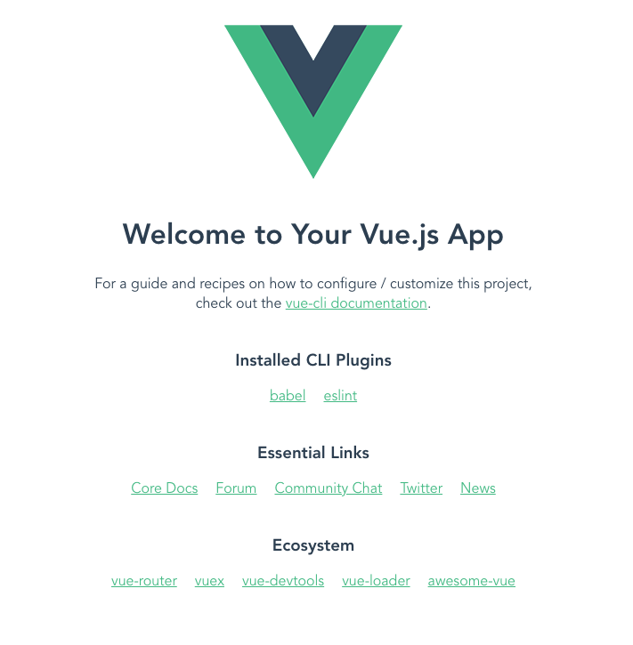
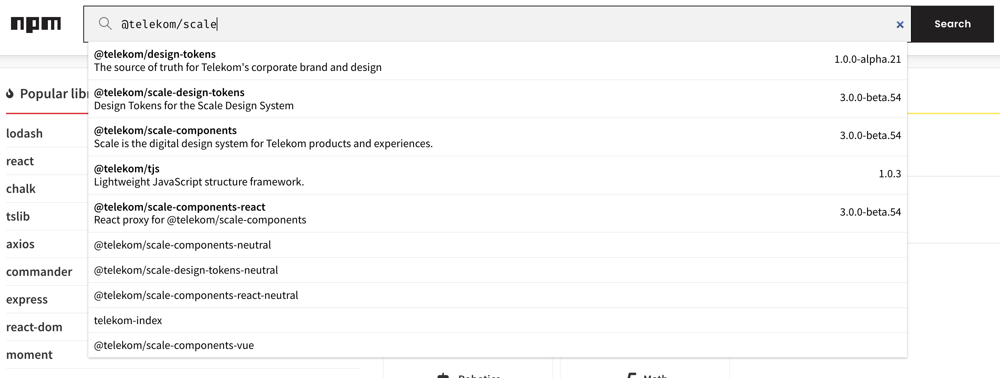
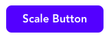

# Scale Tutorial
This is a short Tutorial on how to create Frontends with @telekom/scale.
Since this is a private Project and not a Project for Deutsche Telekom I'm using the unbranded version of scale. Please beware when following this tutorial, that the brand of Deutsche Telekom is exclusive to Deutsche Telekom. More information's can be found on the @telekom/scale repository.

## 1. Project initialization
For tutorial purposes we are using Vue.js with Vue cli. The setup would be similar for different frameworks and Cli Tools. But Vue.js has excellent support for Webcomponents compared to React and is simpler and faster to setup than Angular for tutorial purposes.

Prerequisite:
- Node.js installed
- npm installed

To start of download vue-cli by typing into a console:
`npm install -g @vue/cli`

Afterwards navigate to the location you want to create your project in and type:
`vue create project-name`
Vue-cli will ask you for the Version of Vue you want to use. Select Default (Vue3 babel, eslint)

If you now want to try out your setup now you can type `npm run serve` in your project folder. And visit `localhost:8080` in your browser.


## 2. Installing Scale
The next step to install the scale components itself.  
If you search for scale on npmjs.org you will find may results:

We want to install @telekom/scale-components-neutral, if you are a Telekom employee doing a work project you want to use @telekom/scale-components.

Install it by simply typing `npm install @telekom/scale-components-neutral` into your console.

Now you need to make it available in your application. For that open the `src/main.js` file and add 

```js
import { defineCustomElements } from '@telekom/scale-components-neutral/loader';
import '@telekom/scale-components-neutral/dist/scale-components/scale-components.css';

defineCustomElements();
```
to the top of the file.

You may also want to add:
```js
const app = createApp(App).mount('#app')
app.config.compilerOptions.isCustomElement = (tag) => tag.startsWith('scale-');
```
to the main.js to prevent compile errors.

And thats it.
Scale should e installed and can be used in your Application now!

## 3. Using Scale inside a Vue Application
Now its time to use scale for that open the `src/app.vue` file and add a scale button by adding `<scale-button>Scale Button</scale-button>` to the `<template>` section.

If you visit the Website now you can see:


Now we want to add typical actions and customization topics to the component.

### 3.1. Events

Lets start with a click event by using the typical Vue syntax.

```html
<scale-button @click="clickEvent">Scale Button</scale-button>
```

You also need to add the method `clickEvent` to the `methods` section of the vue file.

```js
methods: {
  clickEvent() {
    alert('Clicked')
  }
}
```

If you now visit the website you can see the button is clickable. And an alert will show up once you click on it. Without Vue you would use the classic javascript method (once you added the id `button` to the component):
```js
document.querySelector('#button').addEventListener('click', () => {
  alert('Clicked')
})
```

If you are working with scale components you can find documentation of the events in the Storybook.

### 3.2 Attributes
A lot of Scale components have attributes that can be used to customize them. Lets use some of the button.

```html
<scale-button variant="secondary">Scale Button Secondary</scale-button>
```

This code will introduce the secondary style to the button. You can find more attributes in the storybook.

A special Attribute is the `styles` attribute. Not every component has this attribute. But if you want to inject css styles into your component.

```html
<scale-button style=".button{background-color: green !important}">Scale Button Green color</scale-button>
```

Its a powerful tool but should be handled carefully.

### 3.3 CSS Tokens
Now lets take a look at the CSS Tokens. At the point of this writing we are still using `scl-` tokens. If you are reading this later on they may be replaced by the `telekom-` tokens.

First lets change the tokens for a specific component.
Lets add:
```jsx
<template>
  <scale-button id="button">Scale Button</scale-button>
</template>

<style>
#button{
  --background-primary: green;
}
</style>
```

Again this will create a green button. Overwriting the "local" tokens of a component. You can find the overwritable tokens in the storybook.

Its also possible, even tho not necessarily recommended, to overwrite the global tokens.

```jsx
<style>
  html{
    --scl-color-primary: orange !important;
  }
</style>
```

This will overwrite any usage of the primary color. In the Telekom Style this will overwrite the Magenta color and in the neutral style this will overwrite the blue color.

This concludes the section about customization. In the next section we will combine a few more components to create a more complex example.

## 4. Combining Components
Lets look back to the button. We have 3 Buttons on our Application right now and we now want the second one to open a Scale Modal on click.

First we need to add the Scale Modal, the Events and 
```jsx
<template>
  <scale-modal :opened="modalOpened" @scaleClose="closeModal" heading="Modal Dialog">
    <p>Hello. Here is your Modal :)</p>
    <scale-button variant="secondary" @click="closeModal">
      Cancel
    </scale-button>
  </scale-modal>
</template>
<script>
export default {
  data() {
    return {
      modalOpened: false
    }
  },
  methods: {
    openModal() {
      this.modalOpened = true
    },
    closeModal() {
      this.modalOpened = false
    }
  }
}
<script>
```

Now, after adding the event `@click="openModal"` to the button, you will have the Modal Dialog ready to open once the button is clicked.

Now we can take a look at slots. A functionality of Webcomponents which enables you to put content into specific locations. In the case of the Modal Dialog we want to put the close button into the bottom right. For that Scale offers the `actions` slot. Add it to the close Button like this:
```jsx
<scale-button slot="action" variant="secondary" @click="closeModal">
```

(If you are getting an Error at this point add the rule `"vue/no-deprecated-slot-attribute": "off"` to your `eslint` config)

Now the button will be on the right side of the Modal.

As a last step we want to add a tooltip to one of the Buttons.
You can do so by wrapping the Button (or any Component you like) in a `scale-tooltip` component.

```jsx
<scale-tooltip content="Tooltip" placement="right">
  ...
</scale-tooltip>
```
This might change the styling of the Application slightly but we wont bother about this for now.

Here again you can use the slot Attribute to move more complex information into a tooltip. For example a Image.
```jsx
<scale-tooltip placement="bottom">
  
  ...
</scale-tooltip>
```
## 5. Conclusion
And thats it. Those are the basics of Scale.
If you have any additional questions contact me or create a GitHub Issue.

## Contact
Calvin Schröder <calvin-schroder@hotmail.com>

[Website](https://calvin-schroeder.de)
